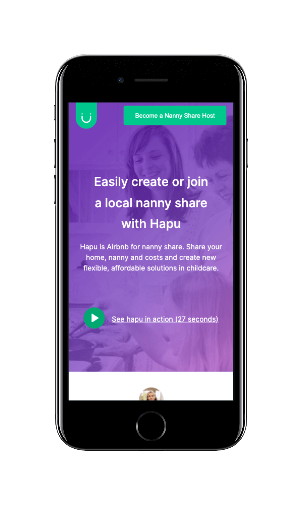

 # Challenge Jungle Devs
## Description

 Challenge proposed by Jungle Devs, the objective of demonstrating how React works. This is a simplified version of of Hapu’s ‘Become a Nanny Share Host’ 
## Install and Run

- Clone this repository with `git clone https://github.com/FeelipePM/challenge-jungle-devs.git`
- Install dependencies using `yarn install`
- Run project in development `yarn dev`
- Run project in production `yarn build`

## Development
### `yarn dev`
Runs the app in the development mode.\
Open [http://localhost:8080](http://localhost:8080) to view it in the browser.

## Production
### `yarn build`

Builds the app for production to the `build` folder.\
It correctly bundles React in production mode and optimizes the build for the best performance.

## Technologies
- React
- Unform
- CSS
- Yup
- Axios
- React icons
## Preview
 

    
    
 
